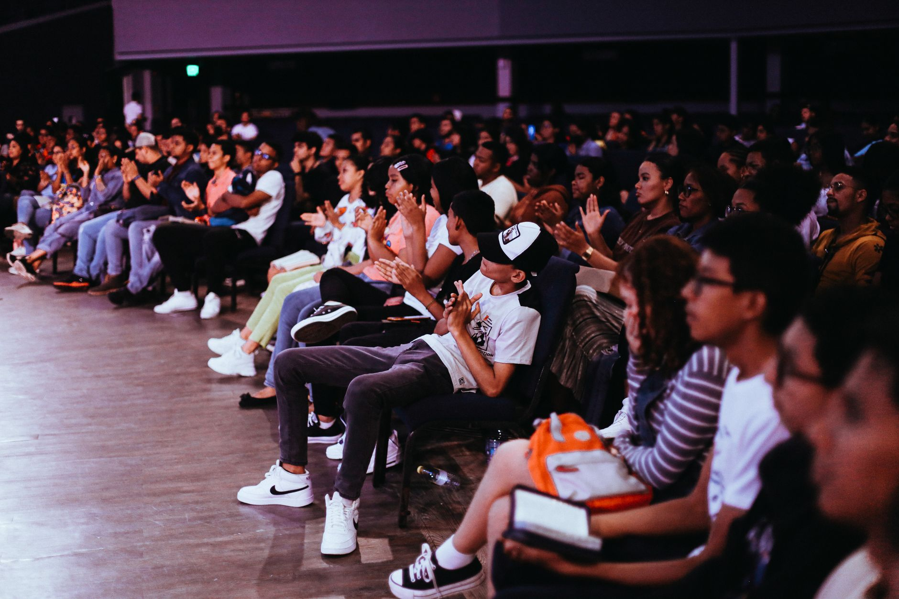

 

# 🛡️ PHÒNG CHỐNG BẠO LỰC HỌC ĐƯỜNG

### *Chung tay xây dựng môi trường học tập an toàn — Trường học là nhà*

 

 

 

**[🚀 Xem Demo](https://hql-coder.github.io/thuyet_trinh_nhom_6/) · [📖 Hướng Dẫn](#-cách-chạy) · [🐛 Báo Lỗi](https://github.com/hql-coder/thuyet_trinh_nhom_6/issues) · [💡 Đề Xuất](https://github.com/hql-coder/thuyet_trinh_nhom_6/issues)**

---

## 📑 Mục Lục

- [🌟 Giới Thiệu](#-giới-thiệu)
- [✨ Tính Năng Nổi Bật](#-tính-năng-nổi-bật)
- [🎬 Demo Online](#-demo-online)
- [🗂️ Cấu Trúc Dự Án](#️-cấu-trúc-dự-án)
- [🚀 Cách Chạy](#-cách-chạy)
- [⌨️ Phím Tắt Điều Khiển](#️-phím-tắt-điều-khiển)
- [📋 Danh Sách 14 Slide](#-danh-sách-14-slide)
- [🖼️ Tải Ảnh Tự Động](#️-tải-ảnh-tự-động)
- [🎨 Tùy Chỉnh](#-tùy-chỉnh)
- [🌐 Deploy Lên GitHub Pages](#-deploy-lên-github-pages)
- [🛠️ Công Nghệ Sử Dụng](#️-công-nghệ-sử-dụng)
- [📊 Thống Kê Dự Án](#-thống-kê-dự-án)
- [🤝 Đóng Góp](#-đóng-góp)
- [📜 Giấy Phép](#-giấy-phép)
- [👥 Nhóm Thực Hiện](#-nhóm-thực-hiện)
- [💝 Lời Cảm Ơn](#-lời-cảm-ơn)

---

## 🌟 Giới Thiệu

> **"Bạo lực học đường không chỉ là vấn đề của riêng ai — đó là vấn đề của cả xã hội."**

Đây là bộ **slide thuyết trình tương tác 14 slide** về chủ đề **Phòng Chống Bạo Lực Học Đường**, được xây dựng bằng **HTML5, CSS3 và JavaScript** hiện đại, sử dụng framework thuyết trình mạnh mẽ nhất hiện nay — **Reveal.js**.

Dự án được thực hiện bởi **Nhóm 6** như một phần của bài thuyết trình môn học, nhằm mục đích nâng cao nhận thức cộng đồng về vấn nạn bạo lực học đường.

### 🎯 Mục Tiêu Dự Án

| Mục tiêu | Mô tả |
|:--------:|-------|
| 📚 **Giáo dục** | Nâng cao nhận thức về bạo lực học đường |
| 🛡️ **Phòng ngừa** | Trang bị kiến thức để phòng tránh |
| 💪 **Hành động** | Khuyến khích học sinh lên tiếng |
| 🌈 **Lan tỏa** | Truyền tải thông điệp yêu thương |

---

## ✨ Tính Năng Nổi Bật

<table>
<tr>
<td width="50%">

### 🎬 Animation & Hiệu Ứng

- ✅ **Fade-up** — Trượt lên mượt mà
- ✅ **Slide-in** — Trượt từ trái/phải
- ✅ **Zoom-in** — Phóng to ấn tượng
- ✅ **Flip-in** — Lật 3D độc đáo
- ✅ **Glow** — Phát sáng tiêu đề
- ✅ **Pulse** — Nhịp đập trái tim
- ✅ **Particles** — Hạt bay lơ lửng
- ✅ **Counter** — Đếm số tự động

</td>
<td width="50%">

### 🚀 Tính Năng Kỹ Thuật

- ✅ **Reveal.js 4.6.1** — Framework mạnh mẽ
- ✅ **Responsive** — Mobile/Tablet/Desktop
- ✅ **Phím tắt** — Điều khiển nhanh
- ✅ **Speaker Notes** — Ghi chú thuyết trình
- ✅ **Progress Bar** — Thanh tiến trình
- ✅ **Slide Number** — Số slide
- ✅ **Export PDF** — Xuất PDF 1 click
- ✅ **Zero Config** — Chạy ngay không cần setup

</td>
</tr>
</table>

---

## 🎬 Demo Online

### **[👉 NHẤN VÀO ĐÂY ĐỂ XEM DEMO 👈](https://hql-coder.github.io/thuyet_trinh_nhom_6/)**

### 📸 Hình Ảnh Minh Họa

<table>
<tr>
<td width="50%" align="center">

**Slide 1 — Bìa**

</td>
<td width="50%" align="center">

**Slide 3 — Thực Trạng**

</td>
</tr>
<tr>
<td width="50%" align="center">

**Slide 10 — Giải Pháp**

</td>
<td width="50%" align="center">

**Slide 14 — Kết Thúc**

</td>
</tr>
</table>

---

## 🗂️ Cấu Trúc Dự Án
